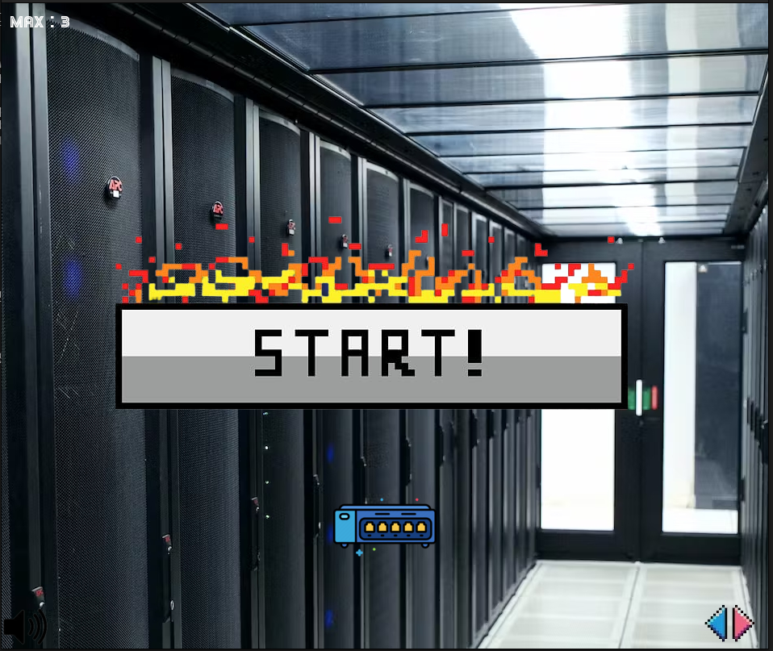
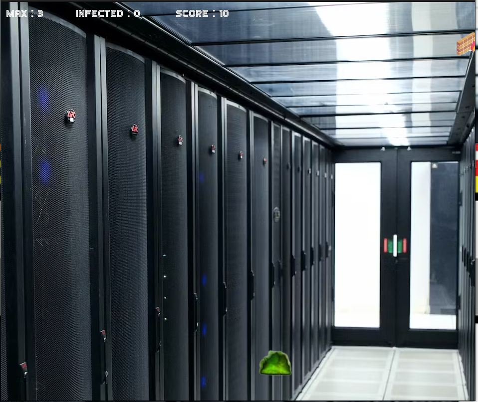
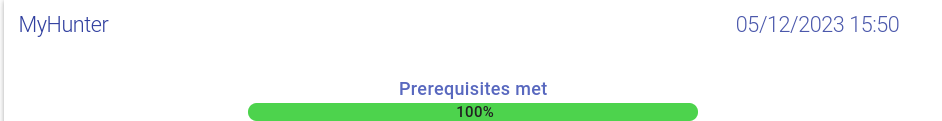

## Popeye


The application is composed of 5 elements:
- **Poll**, a Flask Python web application that gathers votes and push them into a Redis queue.
- **A Redis queue**, which holds the votes sent by the Poll application, awaiting for them to be
consumed by the Worker.
- **The Worker**, a Java application which consumes the votes being in the Redis queue, and stores
them into a PostgreSQL database.
- **Database**, a PostgreSQL database , which (persistently) stores the votes stored by the Worker.
- **Result**, a Node.js web application that fetches the votes from the database and displays the result

## Usage
```
make && ./my_hunter
```

## Help
```
./my_hunter -h
```

## Results screen




## Automatics tests

Score : 28